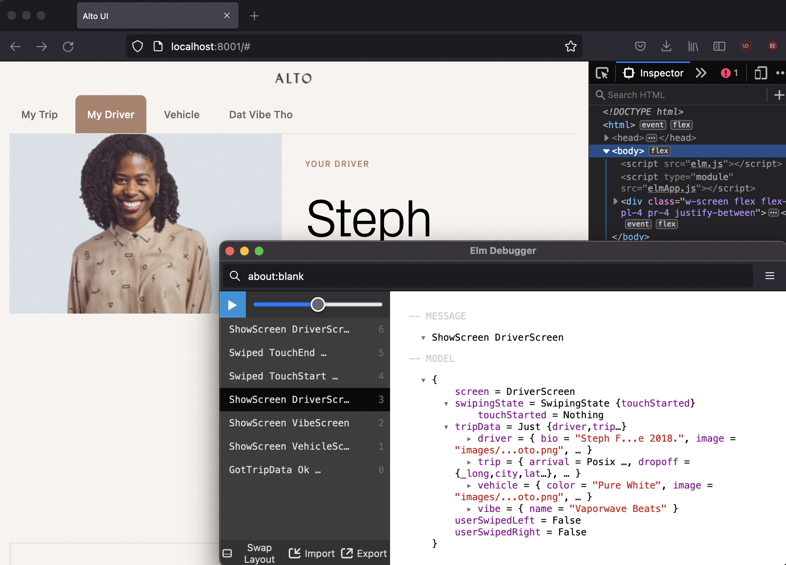
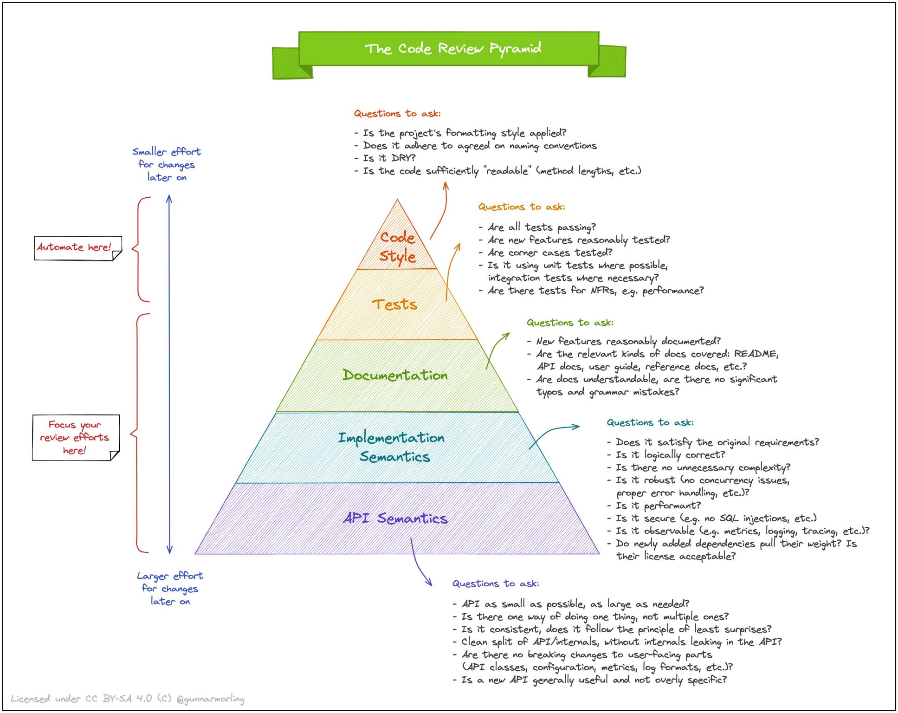

# What

Alto UI is a web UI and light server API built for the Alto UI Test. The Alto UI shows the user's current Trip, Driver, Vehicle, and Vibe through a web UI that has 3 breakpoints for mobile, tablet, larger.

# Contents

- [How to Run The Code](#How-to-Run-The-Code)
- [How to Update Code](#How-to-Update-Code)
- [Common Problems Running Code](#Common-Problems-Running-Code)
- [How to Run the Tests](#How-to-Run-the-Tests)
- [How to Run Linting Rules](#How-to-Run-Linting-Rules)
- [Architecture](#Architecture)

# How to Run The Code

1. Checkout the code and `cd` to the root
2. ensure you have at least Node 16 (18 preferable because of the various ES6 modules)
3. run `npm i`
4. run `node server.js`; this'll start the API server so we can get trip data JSON to the UI.
5. open a new terminal and run `npm run watch:css`. This'll start Tailwindcss's compiler, and ensure it compiles the freshest CSS.
6. open a new terminal and run `npm start`. You should now have 3 terminals separately; one running the Node.js Express.js server serving JSON on http://localhost:3000, one compiling CSS, and one running the local ui dev server at http://localhost:8001.


Depending on which breakpoint you're on, you can either click the black dots to navigate between screens, or the tabs. Additionally, if you have mobile emulation on Firefox/Chrome, you can swipe left and right to navigate back and forth between the various screens. There are 3 mobile breakpoints at 278px, 530px, and 745px.

# How to Update Code

The typical code editing scenario goes like this:

1. Do the above to ensure you have elm-live, TailwindCSS, and the Express server running.
2. Open http://localhost:8001 in your browser. I typically size it to the left and put my code editor to the right.

3. Make a change in `Main.elm` and you'll see it refresh in the browser to the left. This includes both code and css as Tailwind will rebuild the CSS at the same time. Any other file outside of `src` will require a manual refresh with some exceptions such as `tailwind.config.cjs`.

# Common Problems Running Code

Something doesn't work 😢. Don't worry, programming + web tooling is fraught with problems. Many are known and common. Read below for potential problems and solutions.

## I Can't Install or Run Anything

You need to have Node.js 16 or 18 installed. The easiest way, on a Mac, to do this is using `nvm`, called Node Version Manager. This allows you to install and uninstall Node.js as well as manage multiple versions of it much easier, and fatster, than manually doing all of this yourself. You can find out how to [instal nvm here](https://github.com/nvm-sh/nvm). The page is long, but you could probably just try:

```bash
curl -o- https://raw.githubusercontent.com/nvm-sh/nvm/v0.39.1/install.sh | bash
```

If that is successful, and you added the bash startup script to your `.baseprofile` or `.zshrc`, then you can test it out by typing `nvm` in your terminal. You should see some kind of wall of text that's documentation for nvm come up.

The next step is to get a list of all the Node.js versions you can install. You can run `nvm ls-remote` and it'll download a list. While slow, you only have to do this once.

Finally, last step is to install and use a Node.js version. I'm brave (foolish?) so I always just use the latest stable version.
1. run `nvm install stable`
2. run `nvm use stable`

Consequently, I'll have `nvm use stable` in my Bash/VSH prompt to always have the latest when I start doing Node.js stuff in Terminal.

While Node.js is pretty backwards and forwards compatiable "because JavaScript", the libraries that use it are not. For speed and feature reasons, I like using the latest greatest, but nvm gives you the option to revert it you have to for supporting a library or configuration.

If the above is successful, you should now be able to run `npm i`, `node server.js`, and the other commands successfully.

**NOTE**: Remember, if you ran an `npm i` or `npm install` with an different version of Node.js, then installed a new one and attempted to `npm start` or `npm run watch:css`, Node may be get confused why things in `node_modules` don't quite match up with the versions it's expecting. If you're going to change Node.js versions drastically (like a major 16 to 18 version vs. like 18.0.0 to 18.0.1), then `rm -rf node_modules` and then `npm i` again to ensure you've got `node_modules` installed that will work with your installed Node.js version.

## When I Save Code, I Just See a Blank White Screen in the Browser, or I Don't See My Style/Code Changes

Unfortunately, our build workflow isn't perfect. The [elm-live](https://github.com/wking-io/elm-live) dev server uses a Node.js connect server to compile and instantly refresh the browser to use the latest compiled JavaScript. However, you also have TailwindCSS doing the same thing to your CSS code, and this can cause a couple of race conditions.

**Happy Path**: Elm make finishes, then TailwindCSS sees your up to date style usage in your code, and compiles the freshest CSS, then finally the browser refreshes. You have your dev tools open with the Network tab having caching disabled, so you're ensured to see the latest code.

Fix: None needed.

**TailwindCSS is too fast**: TailwindCSS compiles, but then Elm make compiles after it. You may have added a new style such as `p-8`, but nowhere in your code is a padding 8rem, so TailwindCSS v3 compile doesn't see any useage of that style so won't compile it into your CSS. When the browser refreshes, you don't see your padding applied.

Fix: Simply save your `Main.elm` again; this will retrigger elm-live + tailwindcss, and Tailwind will now see your CSS style addition.

**Elm-Live is too fast***: You'll see a spinning loader in your browser but a blank white screen. Elm-live and TailwindCSS show no compile/runtime errors, so you're confused.

Fix: Wait 5 seconds for the Connect socket to timeout, and either save your `Main.elm` file again to trigger a rebuild, or just manually refresh your browser.

# How to Run the Tests

To run the unit tests for the server, run `npm test`.

To run the end to end tests for the UI, run `npx cypress open`; there are 3 specs you can run. All 3 only need the UI + TailwindCSS compile running, they emulate the server.

# How to Run Linting Rules

To run [elm-review](https://package.elm-lang.org/packages/jfmengels/elm-review/latest/) against the `Main.elm` Elm code, run `npm run review`. I've checked in code that passes all linting rules, but just in case, you can violate some of the rules to see it work.

Examples include adding a single item to a list, like in the `viewButton` function. I currently have:

```elm
(class enabledButtonStyles :: attributes)
```

But if you use the old school adding 2 lists together:
```elm
([class enabledButtonStyles] ++ attributes)
```

... and run `npm run review`, the Elm Review rules won't like that. I don't have --force/fix on, so you'll have to manually fix, or revert.

I don't have ESLint/TSLint as there isn't enough JavaScript in the `server.js` to justify it for this excercise.

# Architecture

The following outlines some of the decisions in technology choices to provide context for this excercise code.

## UI in Elm & TailwindCSS

There are 2 pieces; Elm for functionality, and TailwindCSS for styling. We use the Tailwind styles in our Elm code for "CSS in JS" style workflow.

## Why Elm and What are the Pieces?

The UI is built in [Elm](https://elm-lang.org/), an [ML based language](https://en.wikipedia.org/wiki/ML_(programming_language) that compiles to JavaScript. We use Elm because:

1. **no runtime exceptions**; no surprise errors in your code at runtime. You + visual designer can confidently handle all error scenarios, and you never have to "go add a try/catch" later or "handle an undefined possibility" later in your code.
2. **no side effects**; all Elm code is pure, and there are no side effects. That means all unit tests require no test doubles (stubs, mocks, spies, etc). This means the unit tests you _do_ write are focused on domain logic or correctness of how your UI works. For algorithms, despite Elm's amazing type system, you'll still want to do fuzz/[property tests](https://en.wikipedia.org/wiki/Property_testing) and Cypress end to end/functional tests.
3. **fearless refactoring**; you'll never be afraid to touch the code out of worry you'll break something unrelated. The type system & compiler will tell you what you need to fix when you change or add a feature.
4. **time travel debugging**; all data changes are based on an [event sourcing](https://martinfowler.com/eaaDev/EventSourcing.html) (like git history). So you can rewind and fast forward the events in the browser to "see" how your app changes over time.

5. **make impossible situations impossible**; using the type system, you can model your types, and thus your UI, to ensure impossible situations don't happen with your data or UI interactions. See [my article](https://jessewarden.com/2019/02/easier-asynchronous-state-modelling-in-react-redux-or-hooks.html) showing a UI example in Redux and Richard Feldman's ["Making Impossible States Impossible"](https://www.youtube.com/watch?v=IcgmSRJHu_8).

Elm compiles to `elm.js` by default; if you use the `--optmize` flag, it'll generate more performant and smaller JavaScript. You should still [optimize more](https://guide.elm-lang.org/optimization/asset_size.html) by running the code through UglifyJS a couple times.

The `index.html` manually embeds this in a script tag. However, you still need to bootstrap the application yourself, and possibly wire up other JavaScript things (such as web analytics), so the `elmApp.js` does this. This file is very similiar to your `index.js` in a React or Angular project. Most elm apps expect you to provide an HTML node to latch onto much like React. However, there are cases in an Elm application where it handles everything and you don't need an `elmApp.js`.

The `elm.json` operates much like the JavaScript `package.json`. The difference is, you don't need to run `npm i` on it; Elm will automatically fetch, cache, and use pacakges when you compile; elm-live abstracts all of this away from you via `npm start`. If you are in a network that rewrites SSL certs, the Haskell package manager won't work, I wrote a [JavaScript elm npm installer](https://github.com/JesterXL/elm-library-installer) that can work around it.

## Why Elm Review?

While Elm's compiler is amazing, you can still write code that isn't great and there are tools that can help you make it great. Linting rules existing in all programming languages, but in Elm, it's a bit easier as compared to something like ESLint; [87% aren't even needed in Elm](https://elmcraft.org/compare/javascript/eslint/) because the language prevents problems, but that's still a lot of room to write bad code. Some of the rules also help runtime performance and bundling size as well.

If you check out the `review/src/ReviewConfig.elm`, you can see all the configured rules. Most of the ones commented out I don't agree with, but could be convinced otherwise.

## Why Elm Format?

While I practice [trunk based development](https://trunkbaseddevelopment.com/), code review has a lot of steps regardless if you're doing Feature Branches or something else. A lot it can be automated and completely remove hours/days of discussions around things that can be automated away. Examples include code formatting. In Go, ReScript, and other languages, it's built into the language. Some like .NET/C# have a popular Resharper plugin. Elm is the same using (elm-format)[https://github.com/avh4/elm-format]. The more we can automate at the top of the pyramid, the more time we have to focus on the harder, more impactful stuff below:



## Why TailwindCSS and What are the Pieces?

We use [TailwindCSS](https://tailwindcss.com/) to make using CSS easier. A lot of CSS workflows have a separate file structure (like SASS or LESS), a compiler, and those files somehow magically get wired up to your bundling system. These styles are then referenced as global variables in your JavaScript.

TailwindCSS is similiar, except, they just provide a bunch of base styles for "all things in CSS" + whatever you add. You can then use them directly on your HTML nodes. This removes the need for writing lots of CSS files. Instead, the tradeoff is more verbose HTML nodes. Some of us like this trade off because:
1. we spend 90% of our writing code time _in_ the HTML.
2. we spend 90% of our reading code time _in_ the HTML.

We want to see "what styles is this component using _here_". When the HTML, CSS, and logic are all in the same place, it's easier for coders who build in a component style of UI development.

The `tailwind.css` is where you put all your base styles, fonts, etc. The TailwindCSS compiler will look at your source code, see what styles you're using, and only compile those styles that you need into a `tailwind.build.css`. This `tailwind.build.css` is what you manually embed into `index.html`.

The `tailwind.config.cjs` is what configures TailwindCSS. For us, that means:
1. what files should trigger a rebuild of CSS
2. what custom fonts, styles, and breakpoints have we created

This allows us to instead of using the default Tailwind blue for backgrounds `bg-blue-600`, we can instead use our custom Alto design system colors, like `bg-alto-primary` and even use that same color pallete or "token color" on other things, like text `text-alto-primary`.

Because Node.js is using it, it has to be `.cjs`. This is in contrast to the `elmApp.js` which is running the browser, so doesn't need `.mjs` file extension, and is using native ES6. Same goes for the unit tests; we default to CommonJS until the module situation improves in the Node.js ecosystem.

All of the above allows you to write `p-8` or "padding: 8rem" in your Elm, HTML, or CSS. Tailwind will see the `p-8` and go "Ah, the developer is using that style, let me compile TailwindCSS styles + that padding class into the `tailwind.build.css` so the developer's HTML can use it". This includes your custom styles as well.

We have 3 breakpoints, small, medium, and large. You'll see them used in the Main.elm code via `medium:p-8` which means "only add a padding of 8rem at a medium or larger breakpoint". These breakpoint prefixes are used all over to support a responsive design.

## Why & What of Express.js?

Nowadays, a UI developer will create their own [Back-End for Front-End](https://samnewman.io/patterns/architectural/bff/), or BFF. For this exercise from Alto, you only need a way to "load data into your UI"; a server isn't required, but to run web UI's, you already have a local server anyway, and Node.js makes it easy to run various server code. So Express.js makes it relatively straightforward to serve your JSON on a specific port separate from your UI.

However, it also enables BFF capabilities. For example, Elm's whole philosophy is around "correctness". The ISO 6801 dates in JavaScript don't always parse correctly and make it hard to know "is this time for you right now, earlier, or later?" ([read the first 3 paragraphs](https://package.elm-lang.org/packages/elm/time/latest/) on elm/time to get more context). That doesn't follow the "correctness" philosophy wheereas Unix' POSIX time does. No matter where you are in the world, POSIX is always correct. If you need to know what the POSIX is _for you_, you just need a time zone. Those are also handled, dynamically, by a database external to browsers and OS's. Providing a good user experience around time is tough, but thankfully POSIX gives us that.

The Alto example JSON does not; it's in a JavaScript date. You _can_ [use ISO 8601 parsing](https://package.elm-lang.org/packages/rtfeldman/elm-iso8601-date-strings/latest/) if you wish, but I want to follow best practices here. On the other hand, I recognize that the back-end may be unchangeable, or there may be legacy reasons it was that way, and it's super hard to change safely. No worries, we'll let the BFF fix it for the UI by converting it to a POSIX time.

The second is the Alto JSON has money in it. This is dangerous to send a UI. Yes, Elm, like JavaScript, has a bunch of wonderful monetary libraries, it's the JSON transfer that's problem #1, and the ambiguity of what the money type is. For example, Int's and Numbers aren't big enough for most money math, you're supposed to use some kind of BigDecimal type. However, JSON doesn't support those sizes so it can get misconfigured. Worse, UI Developers can handle parsing and showing money differnly, leading to strange situations where 2 UI's hitting the same data source show different monetary amounts. Worse, when you start handling currency conversions, such as USD to Euro, things get even more complicated and hard to debug. It's better to have a single source of truth for all that parsing and tell the UI to "just show this". Strings do this nicely. This is what our BFF can also fix for our UI.

The UI will hit the `server.js` Express.js server, and get the POSIX time added to the JSON, as well as the 2 monetary amounts converted to safe strings. By "safe" I mean "2 unit tests against static JSON". I'd prefer to use a safer language to do this in prod compared to this exercise where I got it working well enough.

## Why Mocha?

For most code, I practice Test Driven Development, or TDD. This means I write the test first, before the code. This style follows a Red Green Refactor approach of ensuring the test fails at first, writing the bare minimum amount of code to make it pass, and then continuing to improve the code by Refactoring and keeping the test(s) green.

Pre-Mocha 8 was one of the fatest test suites. In addition, you can write `console.log` and see your logs whether the test passes or fails. Jest doesn't allow this, and is slow. As of Mocha 8 and higher, it's sadly just as slow as Jest, but at least I can see my logs when I'm some debugging some gnarly JavaScript. Mocha like Jest has the possibility for running tests in parallel.

I'm open to other test suite libraries, it's just Mocha is the most battle tested, easiest to debug, and works for Cyrpess as well.

While Jest has much better built-in support for test doubles, and Mocha requires something like Sinon, I don't think they should be used. I'm a functional programmer, and prefer determinisitic stubs using dependency injection. Mocks imply your code has side-effects, and can quickly overwhelm a code base, making the tests brittle, hard to maintain, and usually indicating side effects are too deep in your code. None of these problems exist in Elm, thankfully.

## Why Cypress?

Unless you have a lot of domain logic, most of your UI tests are functional tests. Elm's compiler is so good, while you could do TDD, it's unclear what you'd actually be testing beyond text formatters using fuzz tests. It's better to do that style of testing in functional tests since that's where the 3 main problems Elm doesn't solve:
1. race conditions
2. correctness
3. style drama

Even though you can model async tasks in Elm using [Task](https://package.elm-lang.org/packages/elm/core/latest/Task), you'll still sometimes get race conditions. Cypress can help you quickly find these weird edge cases.

Correctness just means "the app works like we expect it too", and Cypress is one of the fastest test runners that allows you to debug in the browser while the test is running.

Lastly, styles can break your app and have no code equivalent, so Cypress helps have a layer of red green refactor where Elm compiler can't help you.

Puppeteer and Selenium usually require slow and bloated Docker containers that are required to be updated, require frequent Cyber security updates, and are misery for developers to debug. Cypress is also being incorporated into many services such as AWS Amplify, making it easier from an Ops perspective.

Most imporantly, it's the fastest tool out of the bunch.