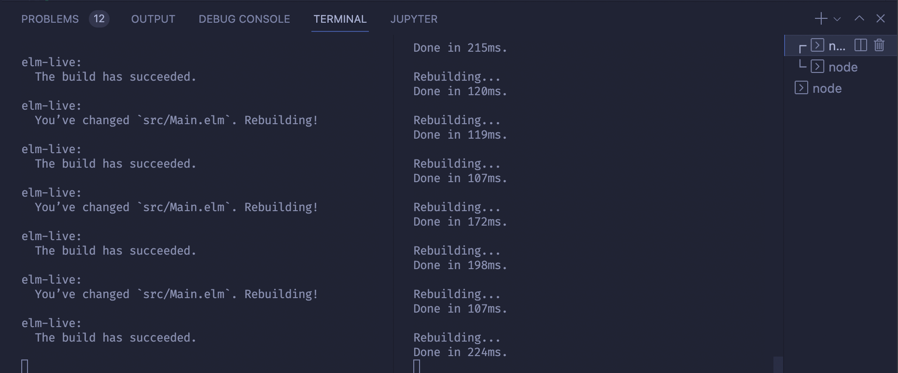

# What

Alto UI is a web UI and light server API built for the Alto UI Test. The Alto UI shows the user's current Trip, Driver, Vehicle, and Vibe through a web UI that has 3 breakpoints for mobile, tablet, larger.

## UI

The UI is a web UI built in [Elm](https://elm-lang.org/) and [TailwindCSS](https://tailwindcss.com/). It includes [Cypress](https://www.cypress.io/) end to end tests to ensure the UI works at various breakpoints (currently they're only whitebox tests as I mock the server). The local dev server uses [elm-live](https://github.com/wking-io/elm-live). For linting, we run [elm-review](https://package.elm-lang.org/packages/jfmengels/elm-review/latest/).

## API

There is a light [Express.js](https://expressjs.com/) API used to server the JSON data for the UI as well as fix some of the data such as changing dates to POSIX and changing the currency to USD and safe formatted strings.

# How to Run The Code

1. Checkout the code and `cd` to the root
2. ensure you have at least Node 16 (18 preferable because of the various ES6 modules)
3. run `npm i`
4. run `node server.js`; this'll start the API server so we can get trip data JSON to the UI.
5. open a new terminal and run `npm run watch:css`. This'll start Tailwindcss's compiler, and ensure it compiles the freshest CSS.
6. open a new terminal and run `npm start`. You should now have 3 terminals separately; one running the Node.js Express.js server serving JSON on http://localhost:3000, one compiling CSS, and one running the local ui dev server at http://localhost:8001.



Depending on which breakpoint you're on, you can either click the black dots to navigate between screens, or the tabs. Additionally, if you have mobile emulation on Firefox/Chrome, you can swipe left and right to navigate back and forth between the various screens. There are 3 mobile breakpoints at 278px, 530px, and 745px.

# How to Update Code

The typical code editing scenario goes like this:

1. Do the above to ensure you have elm-live, TailwindCSS, and the Express server running.
2. Open http://localhost:8001 in your browser. I typically size it to the left and put my code editor to the right.

3. Make a change in `Main.elm` and you'll see it refresh in the browser to the left. This includes both code and css as Tailwind will rebuild the CSS at the same time. Any other file outside of `src` will require a manual refresh with some exceptions such as `tailwind.config.cjs`.

# Common Problems Running Code

Something doesn't work 😢. Don't worry, programming + web tooling is fraught with problems. Many are known and common. Read below for potential problems and solutions.

## I Can't Install or Run Anything

You need to have Node.js 16 or 18 installed. The easiest way, on a Mac, to do this is using `nvm`, called Node Version Manager. This allows you to install and uninstall Node.js as well as manage multiple versions of it much easier, and fatster, than manually doing all of this yourself. You can find out how to [instal nvm here](https://github.com/nvm-sh/nvm). The page is long, but you could probably just try:

```bash
curl -o- https://raw.githubusercontent.com/nvm-sh/nvm/v0.39.1/install.sh | bash
```

If that is successful, and you added the bash startup script to your `.baseprofile` or `.zshrc`, then you can test it out by typing `nvm` in your terminal. You should see some kind of wall of text that's documentation for nvm come up.

The next step is to get a list of all the Node.js versions you can install. You can run `nvm ls-remote` and it'll download a list. While slow, you only have to do this once.

Finally, last step is to install and use a Node.js version. I'm brave (foolish?) so I always just use the latest stable version.
1. run `nvm install stable`
2. run `nvm use stable`

Consequently, I'll have `nvm use stable` in my Bash/VSH prompt to always have the latest when I start doing Node.js stuff in Terminal.

While Node.js is pretty backwards and forwards compatiable "because JavaScript", the libraries that use it are not. For speed and feature reasons, I like using the latest greatest, but nvm gives you the option to revert it you have to for supporting a library or configuration.

If the above is successful, you should now be able to run `npm i`, `node server.js`, and the other commands successfully.

**NOTE**: Remember, if you ran an `npm i` or `npm install` with an different version of Node.js, then installed a new one and attempted to `npm start` or `npm run watch:css`, Node may be get confused why things in `node_modules` don't quite match up with the versions it's expecting. If you're going to change Node.js versions drastically (like a major 16 to 18 version vs. like 18.0.0 to 18.0.1), then `rm -rf node_modules` and then `npm i` again to ensure you've got `node_modules` installed that will work with your installed Node.js version.

## When I Save Code, I Just See a Blank White Screen in the Browser, or I Don't See My Style/Code Changes

Unfortunately, our build workflow isn't perfect. The [elm-live](https://github.com/wking-io/elm-live) dev server uses a Node.js connect server to compile and instantly refresh the browser to use the latest compiled JavaScript. However, you also have TailwindCSS doing the same thing to your CSS code, and this can cause a couple of race conditions.

**Happy Path**: Elm make finishes, then TailwindCSS sees your up to date style usage in your code, and compiles the freshest CSS, then finally the browser refreshes. You have your dev tools open with the Network tab having caching disabled, so you're ensured to see the latest code.

Fix: None needed.

**TailwindCSS is too fast**: TailwindCSS compiles, but then Elm make compiles after it. You may have added a new style such as `p-8`, but nowhere in your code is a padding 8rem, so TailwindCSS v3 compile doesn't see any useage of that style so won't compile it into your CSS. When the browser refreshes, you don't see your padding applied.

Fix: Simply save your `Main.elm` again; this will retrigger elm-live + tailwindcss, and Tailwind will now see your CSS style addition.

**Elm-Live is too fast***: You'll see a spinning loader in your browser but a blank white screen. Elm-live and TailwindCSS show no compile/runtime errors, so you're confused.

Fix: Wait 5 seconds for the Connect socket to timeout, and either save your `Main.elm` file again to trigger a rebuild, or just manually refresh your browser.

# How to Run the Tests

To run the unit tests for the server, run `npm test`.

To run the end to end tests for the UI, run `npx cypress open`; there are 3 specs you can run. All 3 only need the UI + TailwindCSS compile running, they emulate the server.

# How to Run Linting Rules

To run [elm-review](https://package.elm-lang.org/packages/jfmengels/elm-review/latest/) against the `Main.elm` Elm code, run `npm run review`. I've checked in code that passes all linting rules, but just in case, you can violate some of the rules to see it work.

Examples include adding a single item to a list, like in the `viewButton` function. I currently have:

```elm
(class enabledButtonStyles :: attributes)
```

But if you use the old school adding 2 lists together:
```elm
([class enabledButtonStyles] ++ attributes)
```

... and run `npm run review`, the Elm Review rules won't like that. I don't have --force/fix on, so you'll have to manually fix, or revert.

I don't have ESLint/TSLint as there isn't enough JavaScript in the `server.js` to justify it for this excercise.